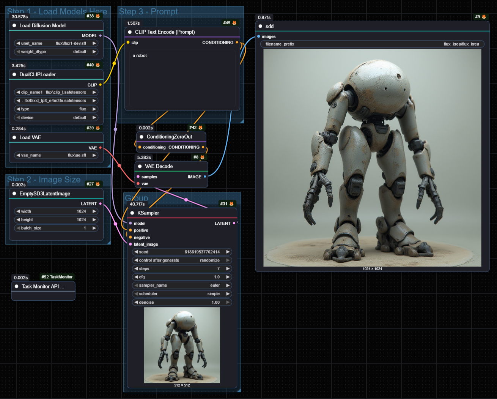
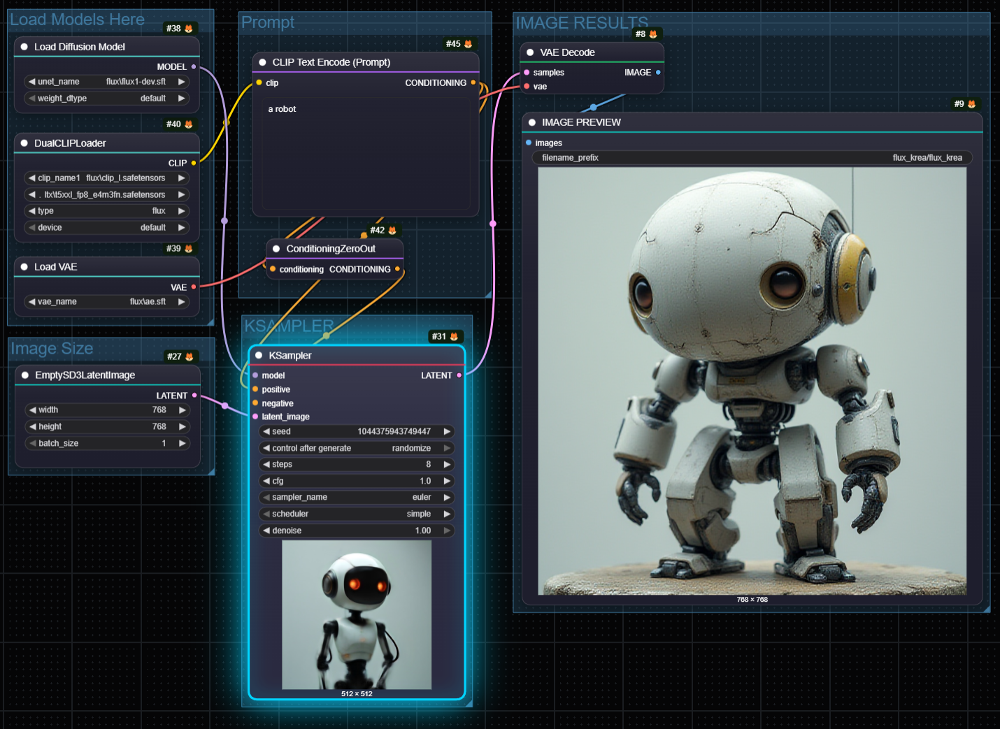
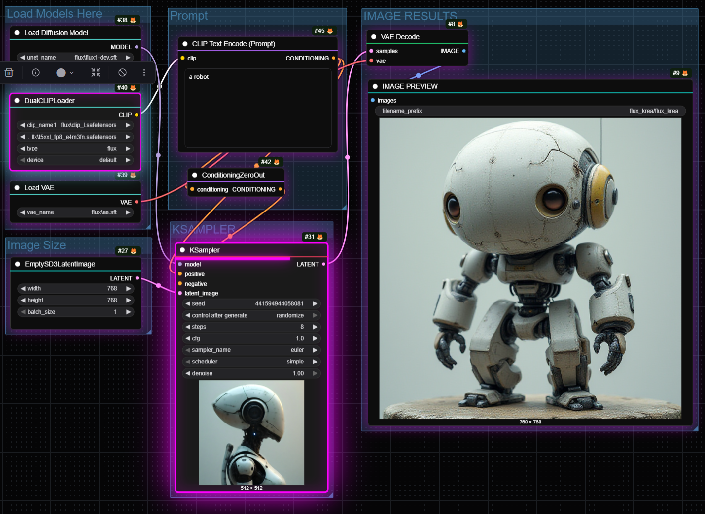
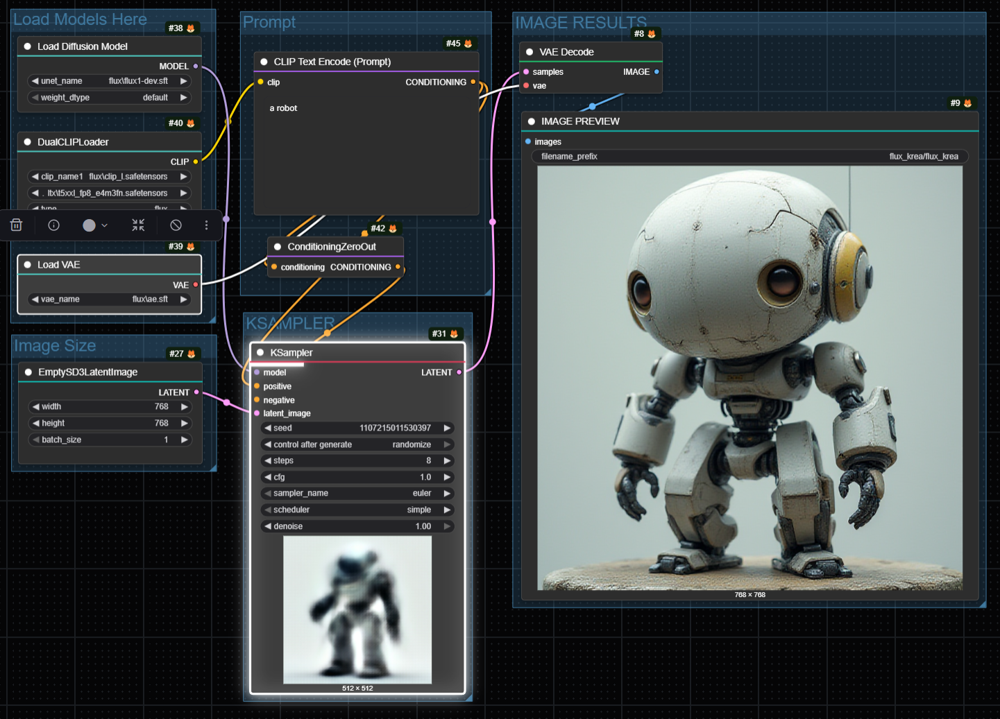
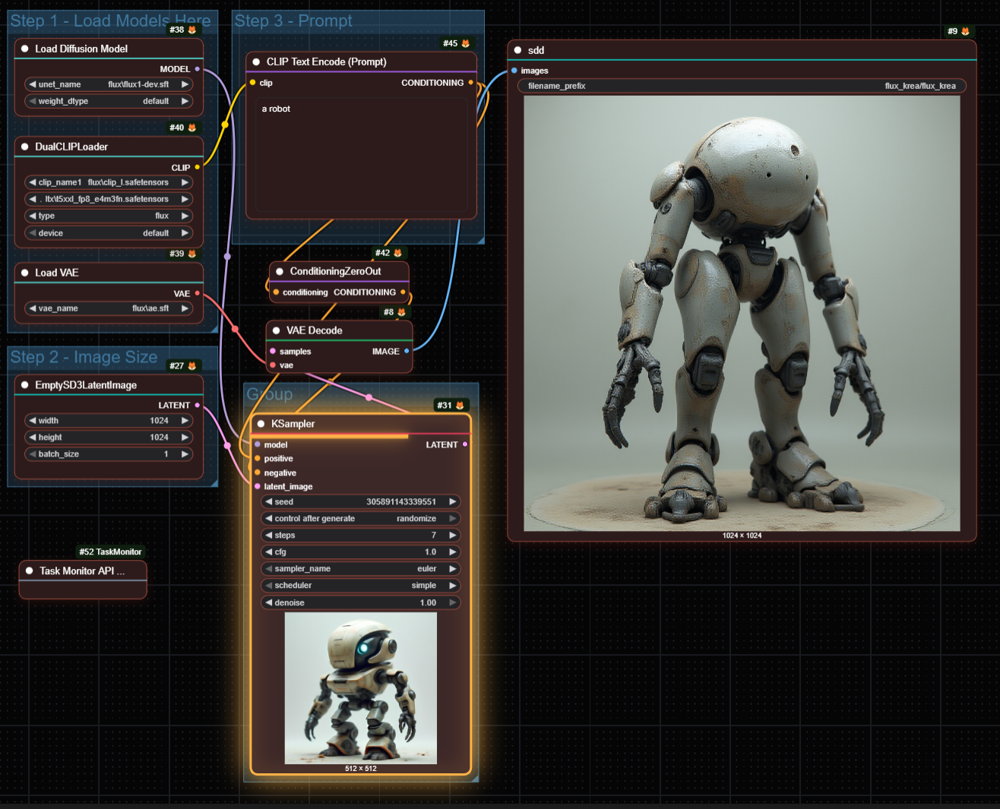
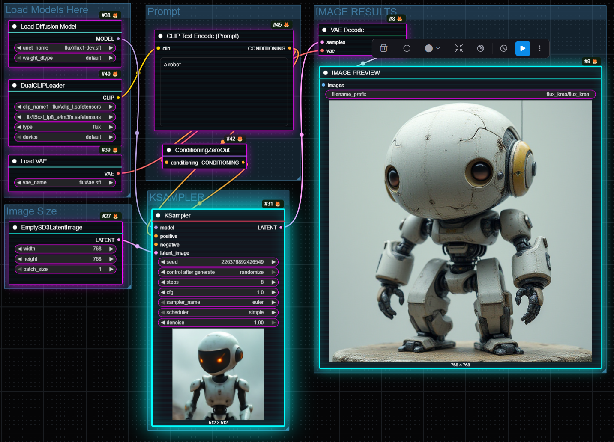
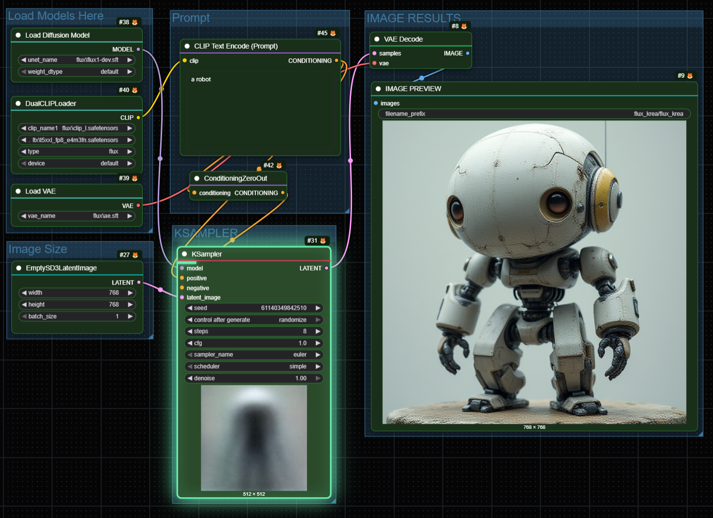
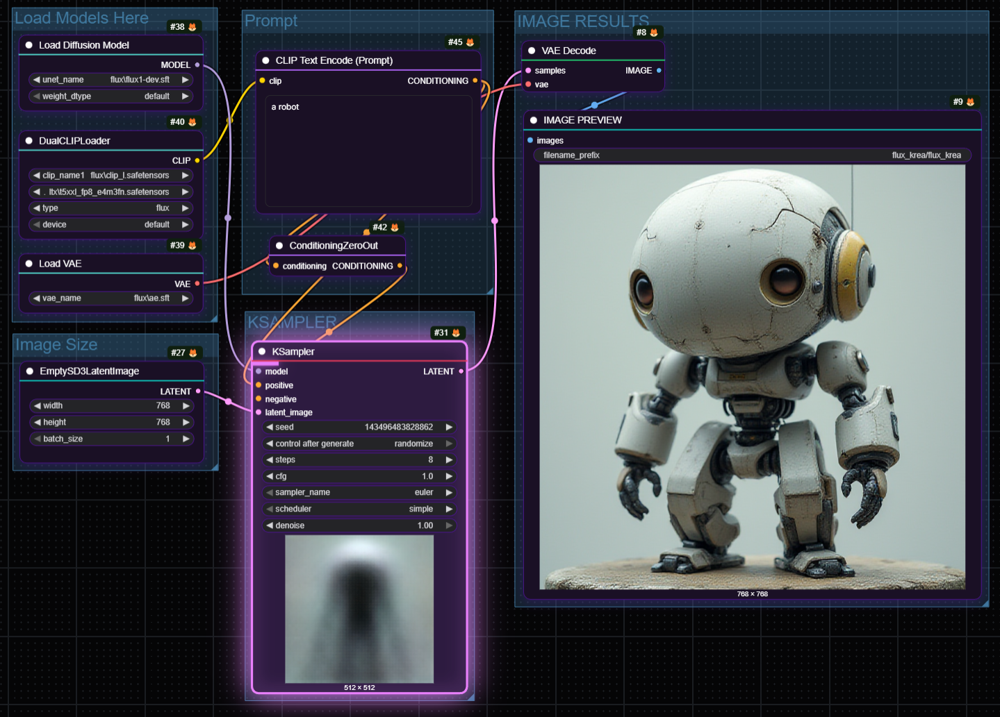
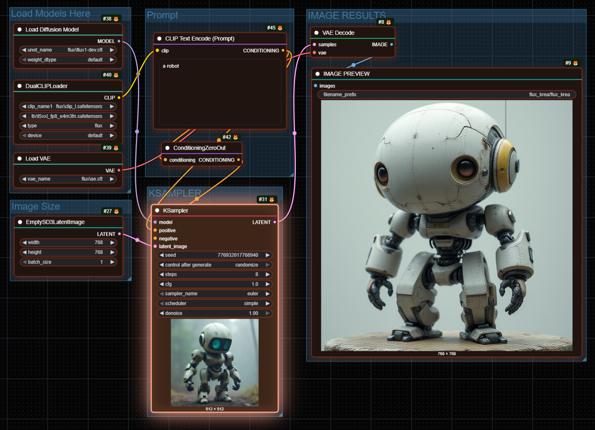

# ComfyUI-Niutonian-Themes


A theme pack for ComfyUI that transforms the nodes into the best 2000's aesthetics styles while preserving full functionality.



## Features

- **10 Unique Themes** - From minimal to cyberpunk, find your perfect style
- **Non-invasive** - Works with all existing nodes and extensions
- **Manual Color Support** - Right-click any node to set custom colors - manual colors override theme styling
- **Execution Glow** - Currently running nodes glow with theme-matched colors
- **Progress Bar** - Themed progress indicator for nodes like KSampler
- **Keyboard Shortcuts** - Quick theme switching with Alt+1 through Alt+0
- **Persistent Selection** - Your theme choice is saved automatically

## Available Themes

### Modern Dark (Alt+1)


### Glassmorphism (Alt+2)


### Neon Glow (Alt+3)


### Minimal Clean (Alt+4)


### Ocean Deep (Alt+5)


### Sunset Warm (Alt+6)


### Cyberpunk (Alt+7)


### Forest Night (Alt+8)


### Midnight Purple (Alt+9)


### Ember Glow (Alt+0)


## Installation

### Method 1: ComfyUI Manager (Recommended)
1. Open ComfyUI Manager
2. Search for "Niutonian Themes"
3. Click Install

### Method 2: Manual Installation
1. Navigate to your ComfyUI custom nodes folder:
   ```
   ComfyUI/custom_nodes/
   ```
2. Clone this repository:
   ```bash
   git clone https://github.com/Niutonian/ComfyUI-Niutonian-Themes.git
   ```
3. Restart ComfyUI

### Method 3: Download ZIP
1. Download the ZIP file from the releases page
2. Extract to `ComfyUI/custom_nodes/ComfyUI-Niutonian-Themes`
3. Restart ComfyUI

## Usage

### Switching Themes
1. Right-click on the canvas to open the context menu
2. Select **Niutonian Theme**
3. Choose your preferred theme from the submenu

Or use keyboard shortcuts:
- **Alt+1** through **Alt+9**: Select themes 1-9
- **Alt+0**: Select theme 10 (Ember Glow)

### Manual Node Coloring
You can override theme colors for individual nodes:
1. Right-click on any node
2. Select a color from the color palette
3. The node will use your custom color instead of the theme color
4. To remove manual coloring, select the default color or clear the color setting

**Note**: Manually colored nodes will not display theme effects (glass, glow, scanlines) but will still show execution glow when running.

## Theme Customization

Each theme includes:
- Node background colors
- Title bar styling with accent gradients
- Border colors (normal and selected states)
- Shadow effects
- Execution glow colors
- Corner radius settings
- Special effects (glass, glow, scanlines)

## Customization

Edit `js/node_styles.js` to:

### Add Custom Style Packs
```javascript
const STYLE_PACKS = {
  myCustomPack: {
    name: "My Custom Pack",
    node_bg: "#1a1a2e",
    node_selected: "#252545",
    node_title_bg: "#16213e",
    node_title_color: "#ffffff",
    border_color: "#0f3460",
    border_selected: "#e94560",
    shadow_color: "rgba(0,0,0,0.5)",
    shadow_size: 12,
    corner_radius: 8,
    executing_color: "#e94560",
    glass: false,
    glow: false,
    scanlines: false,
  },
  // ... existing themes
};
```

### Customize Node Type Colors
```javascript
const NODE_ACCENTS = {
  "Load": "#4ecdc4",
  "MyCustomNode": "#ff00ff",
  "Checkpoint": "#f7b731",
  // ... add your custom node types
  "default": "#778ca3",
};
```

### Available Theme Properties
- `node_bg`: Main node background color
- `node_selected`: Selected node background color
- `node_title_bg`: Title bar background color
- `node_title_color`: Title text color
- `border_color`: Normal border color
- `border_selected`: Selected border color
- `shadow_color`: Drop shadow color
- `shadow_size`: Shadow blur radius
- `corner_radius`: Border radius for rounded corners
- `executing_color`: Color when node is running
- `glass`: Enable glass effect (boolean)
- `glow`: Enable glow effect for selected nodes (boolean)
- `scanlines`: Enable scanline effect (boolean)

## Contributing

Contributions are welcome! Feel free to:
- Submit bug reports
- Propose new themes
- Improve existing themes
- Add new features

## License

MIT License - Feel free to use, modify, and distribute.

## Credits

Created by Niutonian
